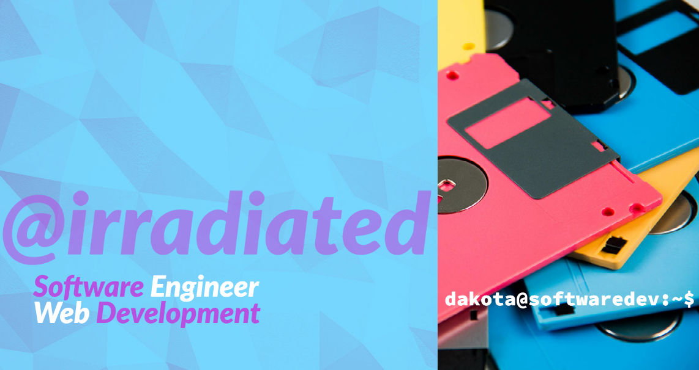

Hey! My name is Dakota, and I'm a Computer Science student, currently enrolled in a BSc in Computer Information Systems. I'm always looking for ways to expand my programming knowledge.

## My Interests

`🐧UNIX` and `💲Bash` are my favourite topics, but I also love `PHP`, `MySQL`, `C`, `Java`, and `Python`.

## My Hobbies

I really have too many, but they include ⌨️ custom keyboards, 
🖥️ computer hardware, 👾 video games (both new and old), and 
🎧 headphones.

In my spare time, I tend a herd of 4 guinea pigs! 🐹🐹🐹🐹

<!--
**irradiated/irradiated** is a ✨ _special_ ✨ repository because its `README.md` (this file) appears on your GitHub profile.

Here are some ideas to get you started:

- 🔭 I’m currently working on ...
- 🌱 I’m currently learning ...
- 👯 I’m looking to collaborate on ...
- 🤔 I’m looking for help with ...
- 💬 Ask me about ...
- 📫 How to reach me: ...
- 😄 Pronouns: ...
- ⚡ Fun fact: ...
-->
